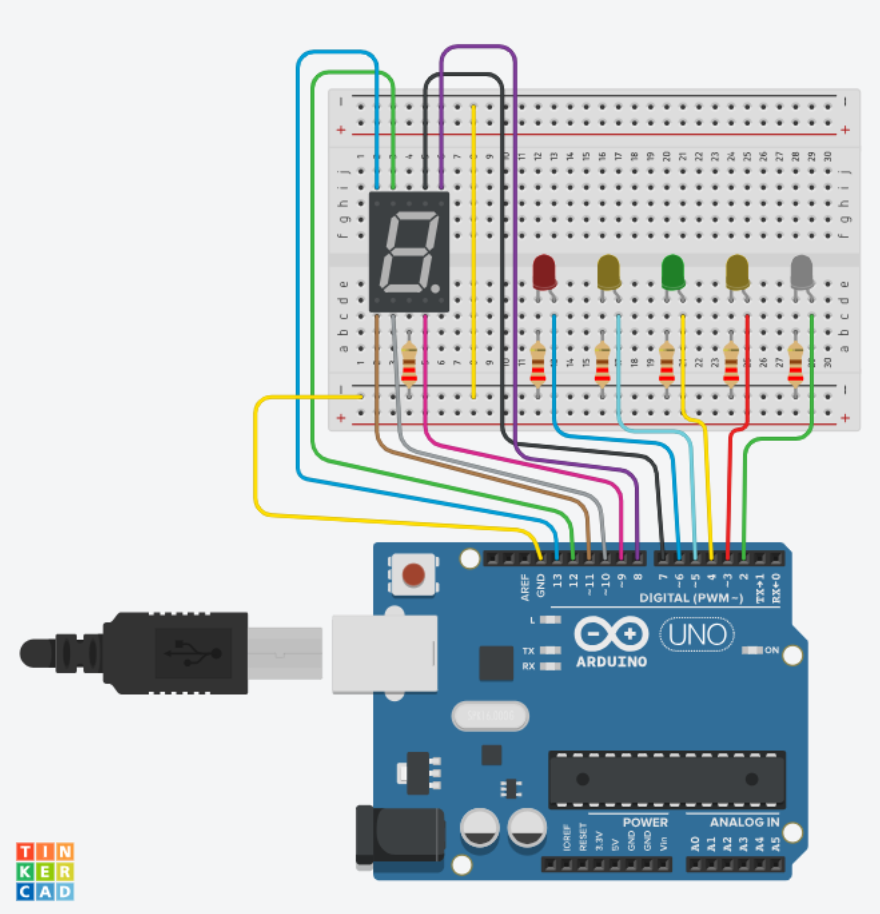

The image above is a hardware circuit used as the prototype for our project. The hardware components include an Arduino UNO microcontroller, five 5 mm LED lights, a seven segment display module, a breadboard, some 220 Ohm resistors, and some male-to-male jumper cables.   

Our project works by combining hardware and software, with the system based on computer vision technology which is real-time hand detection program using MediaPipe library and Open CV library. The programs detect the numbers of finger held up and sends a signal to the Arduino UNO microcontroller to tun on the LED lights according to the number of fingers detected. In addition, the number of open fingers will also be displayed on a seven segment display as a numerical representation.
